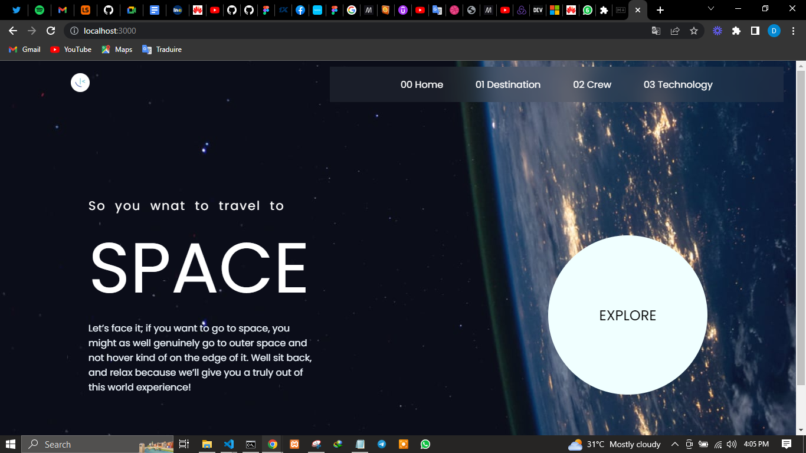
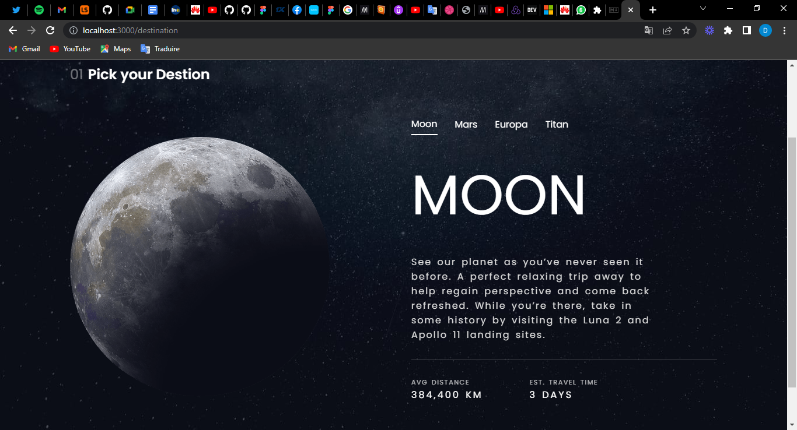
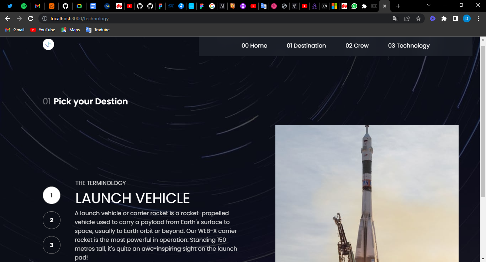

# Frontend Mentor - Space tourism website solution

This is a solution to the [Space tourism website challenge on Frontend Mentor](https://www.frontendmentor.io/challenges/space-tourism-multipage-website-gRWj1URZ3). Frontend Mentor challenges help you improve your coding skills by building realistic projects. 

## Table of contents

- [Overview](#overview)
  - [The challenge](#the-challenge)
  - [Screenshot](#screenshot)
- [My process](#my-process)
  - [Built with](#built-with)
  - [Dependencies](#dependencies)
  - [Author](#author)
- [Acknowledgments](#acknowledgments)

## Overview

### The challenge

Users should be able to:

- View the optimal layout for each of the website's pages depending on their device's screen size
- See hover states for all interactive elements on the page
- View each page and be able to toggle between the tabs to see new information

### Screenshot

#### Home

#### Destination

#### Technology

## My process

### Built with

- [React](https://reactjs.org/) - JS library
- [React-redux](https://react-redux.js.org/) State container for react
- [React-router-dom](https://www.npmjs.com/package/react-router-dom) For navigation
- [Redux-Toolkit](https://redux-toolkit.js.org/) 
- CSS custom properties
### Dependencies 

- "@reduxjs/toolkit"
- "react"
- "react-dom"
- "react-redux"
- "react-router-dom"
- "react-slick"
- "slick-carousel"
## Author

- Github - [didier_snake](github.com/didier_snake)
- Twitter - [@yourusername](https://www.twitter.com/didier_snake)

